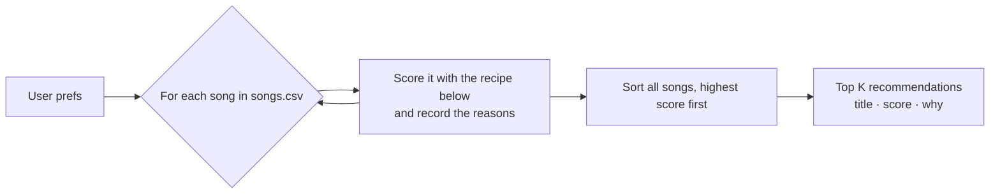

# 🎵 Music Recommender Simulation

## Project Summary

This is a small content-based music recommender that runs from the command line. It loads 18 songs from `data/songs.csv` and scores each one against a user's taste profile (favorite genre, favorite mood, target energy, target valence, and whether they like acoustic music). It then prints the top five songs with a per-feature explanation of the points each one earned. I tested it on three realistic listener profiles and four adversarial edge cases to see where the scoring works and where it breaks.

---

## How The System Works

Real-world platforms like Spotify and YouTube combine two approaches. Collaborative filtering uses the behavior of millions of users (likes, skips, replays) to recommend what similar people enjoyed. Content-based filtering compares the qualities of songs to what a user says they like. My version is a simple content-based recommender. It matches a user's taste profile against each song's qualities. Songs score higher when their energy and happiness are *close* to what the user wants, not just higher or lower.

**What each song has:** genre, mood, energy level (0–1), happiness, or valence (0–1), how acoustic it sounds (0–1), tempo, danceability, and artist.

**What the user profile has:** favorite genre, favorite mood, preferred energy level, preferred happiness level (set to the middle, 0.5, if the user doesn't give one), and whether they like acoustic music.

### Data flow



Each song is scored on its own, one at a time. Sorting and picking the top K happen once, after every song has been scored.

### Algorithm recipe

| Feature | Rule | Max points |
|---|---|---|
| Genre | Exact match with the favorite genre | 1.5 |
| Mood | Exact match with the favorite mood | 1.0 |
| Energy | 2.0 × (1 − 2 × the gap between the song's energy and the target), never below 0 | 2.0 |
| Happiness (valence) | 0.5 × (1 − 2 × the gap between the song's valence and the target), never below 0 | 0.5 |
| Acoustic | 0.5 × the song's acousticness, only if the user likes acoustic music | 0.5 |
| **Total** | | **5.5** |

**Ranking:** sort by total score, highest first. If two songs tie, the one closer in energy wins. Each recommendation lists the points it earned per feature, for example "genre match (+1.5); energy very close (+1.8)."

**Why these weights:**
- **Steep closeness:** a song more than 0.5 away from a target gets 0 for that feature. With a plain "1 − gap" rule, even a metal song got most of the energy points for a chill listener, so every song scored at least about 1 point and the lower ranks were nearly tied.
- **Energy counts the most of the number features (2.0):** it best separates calm songs from intense ones. A song that only matches on energy (2.0) can beat one that only matches on genre (1.5).
- **Happiness counts little (0.5):** a middle target like 0.55 is close to many unrelated songs, so a high weight would push up songs with the wrong vibe (for example, rock at 0.91 energy).
- **Genre is above mood (1.5 vs 1.0):** genre is a slightly steadier signal, but the gap is small. Both labels are rare in this catalog (15 genres and 14 moods across 18 songs).
- **Acoustic is a sliding scale:** a song at 0.64 acousticness no longer gets the same bonus as one at 0.92.

**Example (profile: lofi / chill / energy 0.40 / valence 0.55 / likes acoustic):** Library Rain scores 1.5 + 1.0 + 1.80 + 0.45 + 0.43 = **5.18**. The top results are Midnight Coding (5.27), Library Rain (5.18), Focus Flow (4.35), Spacewalk Thoughts (3.38), and Coffee Shop Stories (2.66). High-energy songs like Iron Furnace end up at the bottom, under 0.5 points.

### Expected biases

- **Exact labels miss near matches.** "chill" gets no credit for "relaxed," "peaceful," or "laid-back," and "pop" gets none for "indie pop." Great songs with a similar vibe can rank low because their label is spelled differently.
- **Genre and mood can still outweigh fit.** A lofi song with the wrong energy can outrank a non-lofi song that fits the user's energy and mood almost perfectly.
- **Popular genres in the catalog get better lists.** Lofi has 3 songs, while most genres have 1. A metal fan gets one real match, and the rest of their list is filler chosen only on energy and happiness.
- **Acoustic only works one way.** Users who like acoustic music get a bonus, but users who dislike it get no penalty for acoustic songs, so their preference is ignored.
- **Same artist repeats.** LoRoom has 2 of the top 3 for the lofi profile. Nothing in the recipe encourages variety.
- **Some features are ignored.** Tempo and danceability are stored but not scored, so a user who cares about rhythm can't express it.


---

## Getting Started

### Setup

1. Create a virtual environment (optional but recommended):

   ```bash
   python -m venv .venv
   source .venv/bin/activate      # Mac or Linux
   .venv\Scripts\activate         # Windows
   ```

2. Install dependencies

```bash
pip install -r requirements.txt
```

3. Run the app:

```bash
python -m src.main
```

### Running Tests

Run the starter tests with:

```bash
pytest
```

You can add more tests in `tests/test_recommender.py`.

---

## Sample Recommendation Output

Output of `python -m src.main` for all seven profiles:

```
Loading songs from data/songs.csv...
Loaded songs: 18

============================================================
Profile: High-Energy Pop
Prefs:   {'genre': 'pop', 'mood': 'happy', 'energy': 0.85, 'valence': 0.8, 'likes_acoustic': False}
============================================================

Top recommendations:

Sunrise City - Score: 4.84
Because: genre match (+1.5); mood match (+1.0); energy very close (+1.9); valence close (+0.5)

Gym Hero - Score: 3.65
Because: genre match (+1.5); mood mismatch: intense (+0.0); energy very close (+1.7); valence close (+0.5)

Rooftop Lights - Score: 3.13
Because: genre mismatch: indie pop (+0.0); mood match (+1.0); energy very close (+1.6); valence close (+0.5)

Concrete Crown - Score: 2.04
Because: genre mismatch: hip-hop (+0.0); mood mismatch: confident (+0.0); energy very close (+1.7); valence close (+0.3)

Storm Runner - Score: 1.94
Because: genre mismatch: rock (+0.0); mood mismatch: intense (+0.0); energy very close (+1.8); valence far off (+0.2)
```

```
============================================================
Profile: Chill Lofi
Prefs:   {'genre': 'lofi', 'mood': 'chill', 'energy': 0.4, 'valence': 0.55, 'likes_acoustic': True}
============================================================

Top recommendations:

Midnight Coding - Score: 5.27
Because: genre match (+1.5); mood match (+1.0); energy very close (+1.9); valence close (+0.5); acoustic bonus (+0.4)

Library Rain - Score: 5.18
Because: genre match (+1.5); mood match (+1.0); energy very close (+1.8); valence close (+0.5); acoustic bonus (+0.4)

Focus Flow - Score: 4.35
Because: genre match (+1.5); mood mismatch: focused (+0.0); energy very close (+2.0); valence close (+0.5); acoustic bonus (+0.4)

Spacewalk Thoughts - Score: 3.38
Because: genre mismatch: ambient (+0.0); mood match (+1.0); energy close (+1.5); valence close (+0.4); acoustic bonus (+0.5)

Coffee Shop Stories - Score: 2.66
Because: genre mismatch: jazz (+0.0); mood mismatch: relaxed (+0.0); energy very close (+1.9); valence close (+0.3); acoustic bonus (+0.4)
```

```
============================================================
Profile: Deep Intense Rock
Prefs:   {'genre': 'rock', 'mood': 'intense', 'energy': 0.92, 'valence': 0.4, 'likes_acoustic': False}
============================================================

Top recommendations:

Storm Runner - Score: 4.88
Because: genre match (+1.5); mood match (+1.0); energy very close (+2.0); valence close (+0.4)

Gym Hero - Score: 3.09
Because: genre mismatch: pop (+0.0); mood match (+1.0); energy very close (+2.0); valence far off (+0.1)

Neon Tears - Score: 2.22
Because: genre mismatch: edm (+0.0); mood mismatch: melancholic (+0.0); energy very close (+1.9); valence close (+0.3)

Iron Furnace - Score: 2.12
Because: genre mismatch: metal (+0.0); mood mismatch: aggressive (+0.0); energy very close (+1.8); valence close (+0.3)

Night Drive Loop - Score: 1.73
Because: genre mismatch: synthwave (+0.0); mood mismatch: moody (+0.0); energy close (+1.3); valence close (+0.4)
```

```
============================================================
Profile: Adversarial: Energetic but Sad
Prefs:   {'genre': 'edm', 'mood': 'sad', 'energy': 0.9, 'valence': 0.1, 'likes_acoustic': False}
============================================================

Top recommendations:

Neon Tears - Score: 3.82
Because: genre match (+1.5); mood mismatch: melancholic (+0.0); energy very close (+2.0); valence close (+0.4)

Iron Furnace - Score: 2.10
Because: genre mismatch: metal (+0.0); mood mismatch: aggressive (+0.0); energy very close (+1.7); valence close (+0.4)

Storm Runner - Score: 2.08
Because: genre mismatch: rock (+0.0); mood mismatch: intense (+0.0); energy very close (+2.0); valence far off (+0.1)

Gym Hero - Score: 1.88
Because: genre mismatch: pop (+0.0); mood mismatch: intense (+0.0); energy very close (+1.9); valence far off (+0.0)

Sunrise City - Score: 1.68
Because: genre mismatch: pop (+0.0); mood mismatch: happy (+0.0); energy very close (+1.7); valence far off (+0.0)
```

```
============================================================
Profile: Adversarial: Case-Sensitive Genre
Prefs:   {'genre': 'Pop', 'mood': 'Happy', 'energy': 0.8, 'valence': 0.8, 'likes_acoustic': False}
============================================================

Top recommendations:

Sunrise City - Score: 2.38
Because: genre mismatch: pop (+0.0); mood mismatch: happy (+0.0); energy very close (+1.9); valence close (+0.5)

Rooftop Lights - Score: 2.33
Because: genre mismatch: indie pop (+0.0); mood mismatch: happy (+0.0); energy very close (+1.8); valence close (+0.5)

Concrete Crown - Score: 2.24
Because: genre mismatch: hip-hop (+0.0); mood mismatch: confident (+0.0); energy very close (+1.9); valence close (+0.3)

Lanterns on the Hill - Score: 2.02
Because: genre mismatch: folk (+0.0); mood mismatch: euphoric (+0.0); energy very close (+1.6); valence close (+0.4)

Night Drive Loop - Score: 1.99
Because: genre mismatch: synthwave (+0.0); mood mismatch: moody (+0.0); energy very close (+1.8); valence far off (+0.2)
```

```
============================================================
Profile: Adversarial: Acoustic Headbanger
Prefs:   {'genre': 'metal', 'mood': 'aggressive', 'energy': 0.95, 'valence': 0.2, 'likes_acoustic': True}
============================================================

Top recommendations:

Iron Furnace - Score: 4.92
Because: genre match (+1.5); mood match (+1.0); energy very close (+1.9); valence close (+0.5); acoustic bonus (+0.0)

Neon Tears - Score: 2.24
Because: genre mismatch: edm (+0.0); mood mismatch: melancholic (+0.0); energy very close (+1.8); valence close (+0.5); acoustic bonus (+0.0)

Storm Runner - Score: 2.11
Because: genre mismatch: rock (+0.0); mood mismatch: intense (+0.0); energy very close (+1.8); valence far off (+0.2); acoustic bonus (+0.1)

Gym Hero - Score: 1.95
Because: genre mismatch: pop (+0.0); mood mismatch: intense (+0.0); energy very close (+1.9); valence far off (+0.0); acoustic bonus (+0.0)

Sunrise City - Score: 1.57
Because: genre mismatch: pop (+0.0); mood mismatch: happy (+0.0); energy close (+1.5); valence far off (+0.0); acoustic bonus (+0.1)
```

```
============================================================
Profile: Adversarial: Out-of-Range Values
Prefs:   {'genre': 'jazz', 'mood': 'relaxed', 'energy': 1.5, 'valence': -0.5, 'likes_acoustic': False}
============================================================

Top recommendations:

Coffee Shop Stories - Score: 2.50
Because: genre match (+1.5); mood match (+1.0); energy far off (+0.0); valence far off (+0.0)

Iron Furnace - Score: 0.00
Because: genre mismatch: metal (+0.0); mood mismatch: aggressive (+0.0); energy far off (+0.0); valence far off (+0.0)

Gym Hero - Score: 0.00
Because: genre mismatch: pop (+0.0); mood mismatch: intense (+0.0); energy far off (+0.0); valence far off (+0.0)

Storm Runner - Score: 0.00
Because: genre mismatch: rock (+0.0); mood mismatch: intense (+0.0); energy far off (+0.0); valence far off (+0.0)

Neon Tears - Score: 0.00
Because: genre mismatch: edm (+0.0); mood mismatch: melancholic (+0.0); energy far off (+0.0); valence far off (+0.0)
```

**Screenshot or video** *(optional)*: <!-- Insert a screenshot or demo video link here -->

---

## Experiments You Tried

Use this section to document the experiments you ran. For example:

- What happened when you changed the weight on genre from 2.0 to 0.5
- What happened when you added tempo or valence to the score
- How did your system behave for different types of users

---

## Limitations and Risks

Summarize some limitations of your recommender.

Examples:

- It only works on a tiny catalog
- It does not understand lyrics or language
- It might over favor one genre or mood

You will go deeper on this in your model card.

---

## Reflection

Read and complete `model_card.md`:

[**Model Card**](model_card.md)

Write 1 to 2 paragraphs here about what you learned:

- about how recommenders turn data into predictions
- about where bias or unfairness could show up in systems like this


